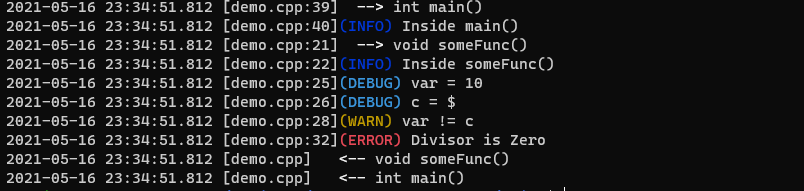

# Cpp Debug Framework
This repository contains the debug framework for your Cpp projects. Nowadays, debugging Cpp program has become a tedious activity when project is too huge for human tracing.

This framework is easily portable to any Cpp project and the debug logs are enabled or disabled using a single debug flag.

**Note**: This framework is not thread-safe yet and will be considered as a future work.

## Directory hierarchy 

The directory hierarchy is as follows

```
├── CMakeLists.txt
├── include
│   └── dbglog.h
├── LICENSE
├── README.md
├── src
│   └── dbglog.cpp
└── test
    ├── cpplist
    │   ├── include
    │   │   ├── apply.h
    │   │   ├── list.h
    │   │   ├── list_node.h
    │   │   └── reduce.h
    │   └── src
    │       ├── apply.cpp
    │       ├── list.cpp
    │       ├── list_iterator.cpp
    │       ├── list_node.cpp
    │       ├── reduce.cpp
    │       └── test.cpp
    ├── demo.cpp
    └── test.cpp
```
The *src/* and *include/* contains core source files for this framework and the test related to these framework can be found in *test/* directory.

## Compiling and running the test cases
Run below commands to compiler

```
$ mkdir build
$ cd build
$ cmake ..
$ make
```
the test case binaries **cpplist**, **dtest**, **demo** can be seen in *build/* directory; run each binaries for individual test cases.

## Macro usage

Add include file *include/dbglog.h* into your cpp source file and compile your source with *src/dbglog.cpp*. The macro usage inside your source file is as explained below.

#### LOG_INIT()
This macro should be used inside every function in the projects to track the function call heirarchy; 

```C++  
 void someFunc()
 {
     LOG_INIT();
     ....
 
 int main()
 {
     LOG_INIT();
     someFunc();
     ....
}
```
The above code should print

```
@31523ns [/home/pratikp/demo.cpp:39]  --> int main()
@61060ns [/home/pratikp/demo.cpp:21]  --> void someFunc()
@67409ns [/home/pratikp/demo.cpp]   <-- void someFunc()
@72335ns [/home/pratikp/demo.cpp]   <-- int main()
```
#### DLOG
Macro used to print logs on the debug terminal/console; enum {INFO, ERROR, WARN} can be used to print specific message as shown below

```C++
void someFunc()
{
    LOG_INIT();
    DLOG(INFO, "info log goes here");
    DLOG(ERROR, "error log goes here");
    DLOG(WARN, "warning log goes here");
}
```
should print

```
@64573ns [/home/pratikp/demo.cpp:128]  --> void someFunc()
@68895ns [/home/pratikp/demo.cpp:129](info) info log goes here
@110744ns [/home/pratikp/demo.cpp:130](error) error log goes here
@179299ns [/home/pratikp/demo.cpp:131](warn) warning log goes here
@256047ns [/home/pratikp/demo.cpp]   <-- void someFunc()
```
#### VDBG
Macro used to print single variable; It gives an easy interface to debug single variable to your cpp file

```C++
void someFunc() 
{
   LOG_INIT();
   DLOG(INFO, "info log goes here");
   DLOG(ERROR, "error log goes here");
   DLOG(WARN, "warning log goes here");
   std::string str = "Batman";
   VDBG(str);
}

int main() 
{
  LOG_INIT();
  someFunc();
  int var = 10;
  VDBG(var);
}
```

should print

```
@27957ns [/home/pratikp/demo.cpp:138]  --> int main()
@56722ns [/home/pratikp/demo.cpp:128]  --> void someFunc()
@92547ns [/home/pratikp/demo.cpp:129](info) info log goes here
@196086ns [/home/pratikp/demo.cpp:130](error) error log goes here
@275469ns [/home/pratikp/demo.cpp:131](warn) warning log goes here
@317409ns [/home/pratikp/demo.cpp:134](debug) str = Batman
@325159ns [/home/pratikp/demo.cpp]   <-- void someFunc()
@337958ns [/home/pratikp/demo.cpp:143](debug) var = 10
@345342ns [/home/pratikp/demo.cpp]   <-- int main()
```
#### XDBG
Macro used to print multiple variables with required message

```C++
int var = 10;
int zed = 20;
XDBG << "var = " << var << " zed = " << zed << std::endl;
```
should print

```
@331102ns [Log.cpp:142](debug) var = 10 zed = 20
```
## Debug Flag

Enable debug flag **DBGFLAG** to complile your cpp code with debug logs

```
$  g++ <files>.cpp  src/dbglog.cpp -Wall -o <exec> -DDBGFLAG 
```

**Note**: Do not forget to include header *include/dgblog.h* to your source file

## Log colors

The logs are encoded with proper colors; the logs for demo test is attached below



RED is used for errors logs; BLUE is used for info logs; CYAN is used for debug logs. The timing logs are encoded in GREEN color for easy encoding.


**Please Note** : This framework is tested on Ubuntu 18.04 machine. Please raise a query for a failure in other machines.
